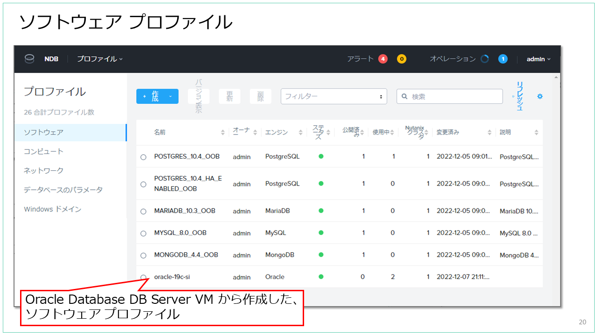
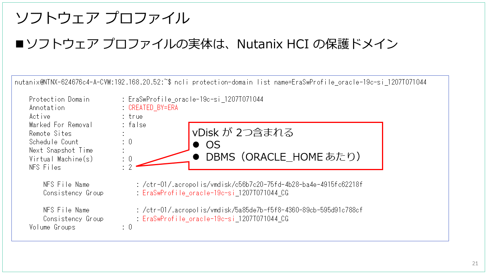

# NDB のプロファイル

NDB では、DB や DB サーバの設定を数種類の「プロファイル」で管理することで、構成をシンプルにしています。
DB / DB サーバをプロビジョニングやクローンを実施する際には、プロファイルを指定することになります。
- ソフトウェア（Software）
- コンピュート（Compute）
- ネットワーク（Network）
- データベースのパラメータ（Database Parameters）
- Windows ドメイン（Windows Domain）

## ソフトウェア（Software）プロファイル

DB と、DB サーバになる仮想マシンの OS イメージを含むプロファイルです。NDB に登録した DB サーバから作成するものですが、ビルトインで用意されている「OOB プロファイル」もあります。

PostgreSQL、MySQL、MariaDB、MongoDB のソフトウェア プロファイルは、ビルトインで用意されています。用意されているものとは異なるバージョンの DBMS ソフトウェアを利用したい場合には、DB サーバを登録して作成することになります。

Oracle Database と Microsoft SQL Server のソフトウェア プロファイルは、ビルトインでは用意されていないため、必ず DB サーバを登録して作成する必要があります。

ソフトウェア プロファイルは、Nutanix HCI 側では保護ドメイン（Protection Domain）を利用して実装されています。

> - [Blog] Nutanix から見た NDB のソフトウェア プロファイル。  
>   https://blog.ntnx.jp/entry/2023/01/24/235412

## コンピュート（Compute）プロファイル

DB サーバ VM のリソース割り当てを設定するプロファイルです。
vCPUs 数とソケットあたりのコア数、メモリ容量を指定できます。

## ネットワーク（Network）プロファイル

NDB でプロビジョニングする DB サーバを接続するネットワークを設定するプロファイルで、AHV ネットワーク（ESXi のポートグループ）、IPAM などの設定ができます。

ネットワーク プロファイルで AHV ネットワークや ESXi ポートグループを指定するには、ハイパーバイザ側で作成した後に、明示的に NDB に登録しておく必要があります。

また、プロファイルは DBMS の種類と構成ごとに作成できるようになっており、Oracle Database であれば、シングル インスタンス用、Oracle RAC 用、といったネットワーク プロファイルを作成することになります。
たとえば Oracle RAC 用のネットワークでは複数のネットワークが必要となるので、プロファイルでは次のようなネットワークを選択することになります。
- パブリック サービス VLAN
- SCAN（Single Client Access Name IP）サービス VLAN
- 仮想サービス VLAN（VIP）
- プライベート サービス VLAN（インターコネクト）

## データベースのパラメータ（Database Parameters）プロファイル

これは、DB インスタンスのパラメータを指定するプロファイルです。
それぞれ DBMS （Oracle Database と SQL Server も含めて）にビルトインのプロファイルが用意されていますが、後から追加作成もできます。

パラメータによっては、NDB によって DB サーバ VM のスペックとの整合性の確認をするものもあるため、作成したデータベース パラメータ プロファイルは、セットで利用する想定のコンピュート プロファイルとあわせて動作確認（実際の DB プロビジョニングなど）が必要です。

## Windows ドメイン（Windows Domain）プロファイル

これは、SQL Server のみで利用するプロファイルです。
DB サーバが参加する AD ドメインと参加の際に指定するユーザ アカウント、WSFC やコンピュータのアカウントを配置する OU、SQL Server と NDB Worker のサービスを開始するアカウントなどを設定します。
