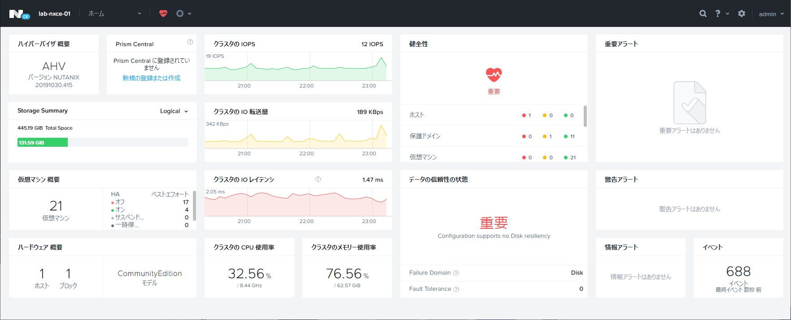
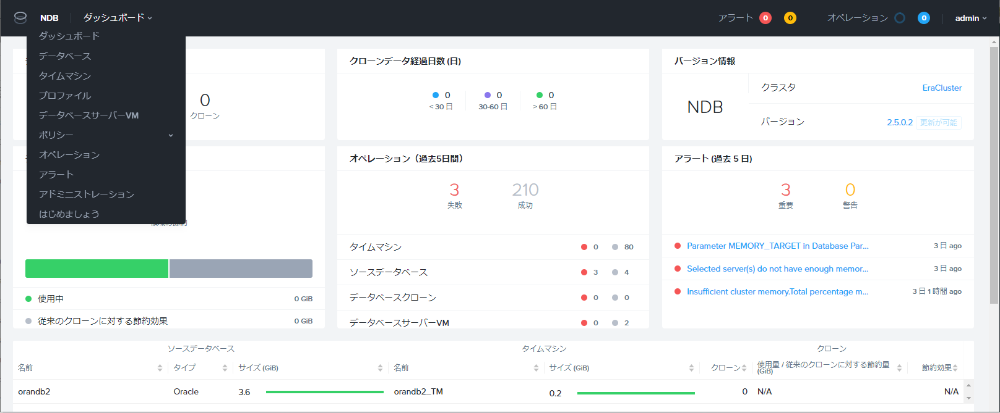
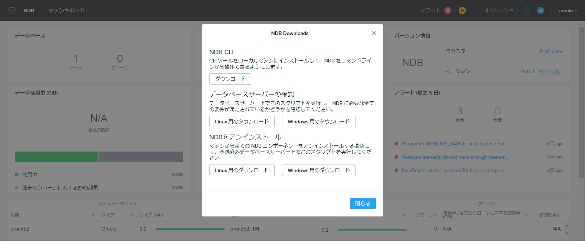
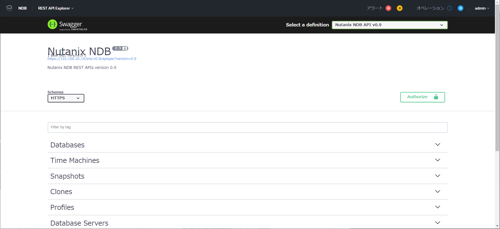
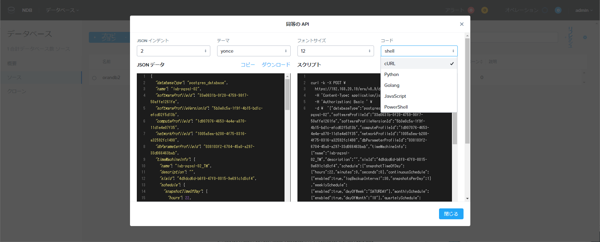

# NDB のツール

NDB を運用するための主要なツールを紹介します。

## Prism Elemtnt

Nutanix HCI においてNutanix クラスタや仮想マシンの管理ツールで、Web ブラウザから利用します。Prism Element を集中管理する「Prism Central」も存在しますが、NDB からは直接的に利用しません。

NDB の運用においては、登録する DB サーバの構築や、NDB でプロビジョニングした DB サーバの停止や再起動をする際に利用することになります。

Nutanix Volumes Storage の Volume Group の管理操作でも利用しますが、基本的に NDB での Volume Group の作成 / 接続 / 削除といった処理は自動化されています。

## NDB Server の Web UI

NDB Server に HTTPS でアクセスすると利用できる Web UI で、基本的に NDB の操作には Prism ではなくこの UI を利用します。
NDB Server 自体の設定と DB の管理操作や、監視などで利用します。

この UI で対応していない操作では、CLI や API を利用することになります。
後述の NDB CLI やスクリプトには、この Web UI からダウンロード可能なものがあります。

## REST API Explorer

NDB には、Nutanix HCI とは別の REST API が用意されています。NDB Server には、API を確認、実行できる Swagger ベース REST API Explorer が内蔵されています。これは、NDB Server の Web UI からアクセスできます。

## API Equivalent（同等の API）ボタン

NDB Web UI の各ウィザードには、「同等の API」ボタンが用意されていて、REST API を利用するスクリプトが自動生成されます。各種言語のスクリプトが表示されるので、DB 管理の自動化が容易になります。

## NDB CLI（era コマンド）

NDB の DB 管理操作で利用できる CLI で、Web UI と同様の操作が可能です。
NDB Server に SSH 接続して利用する CLI で、コマンドの名前は旧製品名である「era」のままです。
NDB の Web UI からダウンロードしてローカルの Linux / macOS マシンで実行することも可能です。

## era-server CLI

NDB Server の設定（ネットワーク設定など）で利用します。
NDB Server に SSH 接続して利用する CLI ですが、NDB CLI（era コマンド）とは別のツールです。

## データベース サーバーの確認 スクリプト（pre-requirement script）

NDB に DB サーバを登録する前のチェックに利用するスクリプトです。
NDB の Web UI、もしくは NDB CLI からダウンロードできます。

- era_linux_prechecks.sh（Linux 用）
- era_windows_prechecks.ps1（Windows 用）

## NDB のアンインストール スクリプト

NDB に登録した DB サーバから、NDB コンポーネントをアンインストールする際に利用します。
NDB の Web UI、もしくは NDB CLI からダウンロードできます。

- era_linux_uninstall.sh（Linux 用）
- era_windows_uninstall.ps1（Windows 用）
