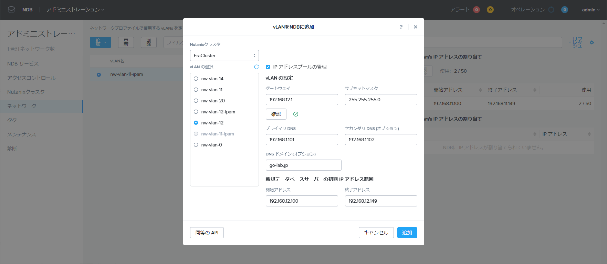

# NDB のネットワーク

NBD でプロビジョニングする DB サーバを接続するネットワークについて説明します。

## ネットワークと IPAM

NDB でのネットワークの準備では、事前に HCI 側でネットワーク（AHV Network またはポートグループ）を作成しておき、それを NDB Server に登録して利用します。

NDB では IPAM（IP アドレス管理）機能を利用しますが、ネットワークごとに、Prism（NDB 外部）か NDB 自身が持つ IPAM のいずれかを利用できます。

NDB 自身の IPAM を利用する場合、AHV ネットワーク側では IPAM を利用しないネットワークを作成しておき、NDB Server 側で IPAM（IP アドレス プールなど）を設定します。

## ネットワーク プロファイル

NDB Server に登録したネットワークは、ネットワーク プロファイルを介して DB サーバのプロビジョニングで指定します。

ネットワーク プロファイルは DBMS ソフトウェアの種類と構成（シングル ノード / クラスタ）を選択したうえで作成します。

たとえば Oracle Database 用には、シングル インスタンスの DB サーバと、RAC によるクラスタ構成の DB サーバのプロフィアルを、それぞれ複数作成できます。

DBMS の構成にあわせたネットワークを選択できます。
たとえば、Oracle RAC 用のネットワーク プロファイルであれば、複数のネットワークが必要となるので、次のネットワークを選択することになります。
- パブリック サービス VLAN
- SCAN（Single Client Access Name IP）サービス VLAN
- 仮想サービス VLAN（VIP）
- プライベート サービス VLAN（インターコネクト）

ネットワーク セグメンテーションについても、ネットワーク プロファイルで設定できます。
基本的には単一ネットワーク構成にしますが、特別な要件にあわせてオプションで分離可能です。

DB サーバの管理/ストレージアクセスのネットワーク（VLAN）を、用途ごとに下記のようにセグメンテーション（分割）できます。
* Prism Element との管理通信
* Prism iSCSI データサービス ※オプション
* NDB サーバからの DB サーバへの通信 ※オプション
* 他のサービス ※オプション（上記以外の特殊要件用）

