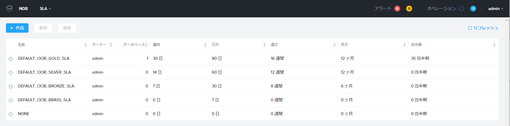

# タイムマシン

NDB では、DB のスナップショットやバックアップ/リストア、クローンを実行するために、タイムマシンと呼ばれるコンポーネントを利用します。

タイムマシンは、ソース DB を登録またはプロビジョニングする際に、DB 単位で必ず作成することになります。

## 主な機能

タイムマシンでは、下記の機能を提供しています。
- スナップショットの取得
- ログのキャッチアップ
- スケジュール設定
- SLA ポリシー

## スナップショットの取得

NDB 側で管理されるスナップショットです。これは Nutanix HCI の Protection Domain のスナップショットが活用されていますが、作成や削除は NDB から実施されます。

NDB によるスナップショットは、アプリケーションの整合性を意識して取得されます。たとえば Oracle Database であればバックアップ モードに切り替えて取得されるので、アーカイブログ モードが有効化されていないと取得が失敗します。

## ログのキャッチアップ

NDB によって、定期的に DB のログがキャッチアップされます。
このログは DB の更新を記録するもので、PostgreSQL の WAL ログ、Oracle Database の REDO ログ、SQL Server のトランザクション ログなどを指します。

ログのキャッチアップは、手動で開始することもできます。

3rd-Party の（NDB 以外の）バックアップ ソフトウェアでも DB をバックアップする場合、バックアップ完了後に DB のログを削除することがあります。そういったバックアップ処理と NDB を併用する場合は、3rd-Party によるバックアップ処理の開始前に NDB のログ キャッチアップが実施されるように考慮しておきましょう。

> DB でログ キャッチアップが実行できない（グレーアウトされている）場合には、タイムマシンに割り当てられている SLA ポリシーが「継続的なログの保存期間」の日数が設定されたものであることを確認します。

## SLA ポリシー

タイムマシンでは、スナップショットとログの定期的な取得と保持期間の管理を SLA というポリシーで

SLA は、デフォルトで下記のものが用意されていますが、追加作成もできます。
スナップショットの取得間隔は、日時、週次、月次、四半期 といった指定が可能です。

> SLA のタイムマシンへの割り当ては、タイムマシンの作成後でも変更可能です。しかし SLA を割り直すと、それまでに取得された DB のスナップショットやログが削除されてしまうので、それより前のリストアやクローン処理が実施できなくなります。

## DB のリストア

NBD では、2種類の DB リストアが可能です。

- スナップショットを指定した DB のリストア
- 時間を指定した DB のリストア、つまり PIT（Point-in-Time）でのリカバリ

> DB の「ポイント イン タイム」でのリストアを実施する場合には、SLA は「継続的なログの保存期間」の日数が設定されたものを指定することで、ログをキャッチアップしておく必要があります。
